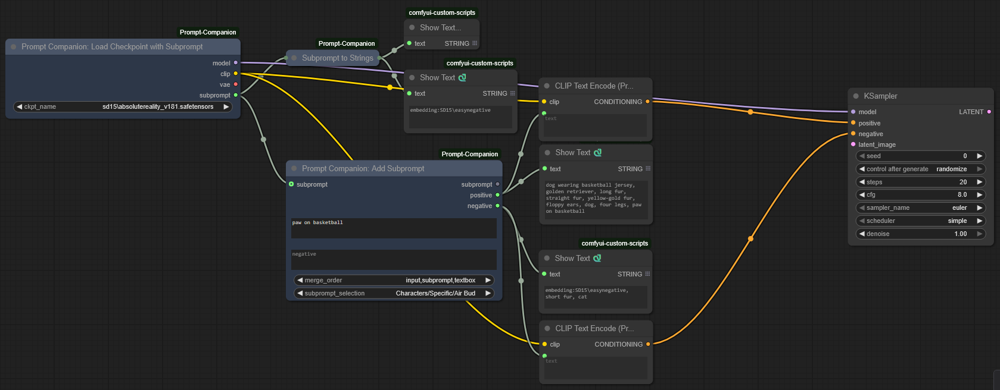

# ComfyUI Prompt Companion

A ComfyUI extension for saving, organizing, and mixing up parts of prompts ("subprompts"). Supports nested subprompts, automatic loading of specific subprompts based on selected checkpoint, and more!

## 🤔 Why use this?

As I was learning ComfyUI, I found that keeping my prompts up to date with my experimental workflows was taking a lot of time. A few examples:

* Manually switching between different embeddings (like `lazyneg`) when switching between checkpoints from different base models.
* Remembering which quality keywords worked well with which checkpoints, and manually switching between them.
* For advanced workflows involving multiple prompts, like rendering/combining multiple images, regional prompting, attention coupling, etc. - ensuring that you're using consistent style and quality keywords across all your prompts.
* Sharing consistent "base" prompts across characters. For example: if you have a set of unique prompts for specific fantasy characters, but all including the same style keywords, and you want to update the style keywords for all those characters at once.

Prompt Companion aims to solve all of those.

## 😃 Neat! How do I get it?

Same as most ComfyUI custom nodes.

### Quick Install (Recommended)

1. Install [ComfyUI](https://docs.comfy.org/get_started).
2. Install [ComfyUI-Manager](https://github.com/ltdrdata/ComfyUI-Manager).
3. Look up "ComfyUI Prompt Companion" in ComfyUI-Manager and install.
4. Restart ComfyUI.
5. The Prompt Companion node will be available in the `prompt-companion` category.

### Manual Install

1. Clone this repository to your ComfyUI custom nodes directory:

   ```bash
   cd ComfyUI/custom_nodes/
   git clone https://github.com/jfcantu/ComfyUI-Prompt-Companion.git
   ```

2. The Prompt Companion node will be available in the `prompt-companion` category.

## 😨 Okay, now how do I use it?

I've tried to make the nodes as intuitive as possible, so here's a quick example workflow to cover the basics:



First things first: the subprompts used here were created using the "Edit Subprompts" dialog, which can be accessed by right-clicking any Prompt Companion node.

* The "Load Checkpoint With Subprompt" node loads the checkpoint. Note that the checkpoint file is in a subfolder, (`sd15/`). Any subprompts with the trigger word `sd15` will be merged together and exported from the `subprompt` output.
  * You can see the output in the top flow: a negative subprompt that simply says `embedding: SD15\easynegative`.
* The subprompt is passed into the "Add Subprompt" node.
  * This node now has three subprompts to merge:
    * `input`: the input from the previous node.
    * `subprompt`: the subprompt selected from the `subprompt_selection` drop-down.
    * `textbox`: the contents of the textbox on the node itself.
  * It merges them using the order specified in `merge_order`.
* The resulting output is seen on the right: positive and negative prompts made from combining the input, subprompt, and textbox (in that order, as specified in `merge_order`.)
* The text can then be used as input to CLIP Text Encode.

In addition to the functional nodes, there are a couple conversion nodes for converting/deconverting between subprompts and positive/negative string pairs.

## 😲 Pretty neat! How can I learn more?

Give [USAGE.md](doc/USAGE.md) a read. It even has pictures!

## 🧪 Development

### Setup

To install the dev dependencies and pre-commit:

```bash
cd ComfyUI-Prompt-Companion
pip install -e .[dev]
pre-commit install
```

### Project Structure

The architecture is organized into specialized modules for maintainability and scalability:

```text
custom_nodes/ComfyUI-Prompt-Companion/
├── __init__.py                # Node package definition
├── pyproject.toml             # Python project definition
├── api_routes.py              # Definition of API routes
│
├── nodes/                     
│   ├── __init__.py            # ComfyUI node definitions
│   ├── prompt_nodes.py        # Subprompt-related notes
│   └── checkpoint_loader.py   # Checkpoint loader with trigger-word support
│
├── core/                     # Storage & Logic
│   ├── __init__.py           # Core module exports
│   ├── storage.py            # UUID-based storage with atomic operations
│   ├── subprompt.py          # Subprompt class with circular reference detection
│   ├── folder.py             # Hierarchical folder management
│   └── validation.py         # Data validation
│
├── web/                      # Frontend Components
│   ├── edit_dialog.js        # Dialog for editing subprompts
│   ├── tree_view.js          # Tree-view control for use in the dialog
│   ├── extensions.js         # ComfyUI integration extensions
│   └── prompt_companion.css  # Visual hierarchy styling
│
└── doc/                      # Documentation & Assets
    ├── USAGE.md              # Usage documentation
    └── *.png                 # Screenshot assets
```

### Key File Responsibilities

#### **Core Storage System**

* **[`core/storage.py`](core/storage.py:1)**: UUID-based storage with thread-safe operations, atomic file writes, cascade deletion, and backup/restore capabilities
* **[`core/subprompt.py`](core/subprompt.py:1)**: Subprompt class with nested resolution, circular reference detection, and validation
* **[`core/folder.py`](core/folder.py:1)**: Hierarchical folder management with UUID-based identification
* **[`core/validation.py`](core/validation.py:1)**: Validation rules for data integrity

#### **Node Integration**

* **[`nodes/prompt_nodes.py`](nodes/prompt_nodes.py:1)**: ComfyUI nodes with dynamic combo boxes, IS_CHANGED method for cache invalidation, and six merge order permutations
* **[`nodes/checkpoint_loader.py`](nodes/checkpoint_loader.py:1)**: Checkpoint loading with trigger word matching

#### **API Layer**

* **[`api_routes.py`](api_routes.py:1)**: REST endpoints with CRUD operations, circular reference validation, and error handling

#### **Frontend Architecture**

* **[`web/tree_view.js`](web/tree_view.js:1)**: Tree view with drag-and-drop, context menus, visual hierarchy indicators, and real-time updates
* **[`web/edit_dialog.js`](web/edit_dialog.js:1)**: Simple editing interface with live preview, organization, drag-and-drop, etc.
* **[`web/extensions.js`](web/extensions.js:1)**: ComfyUI integration layer for workflow integration

## 🤝 Contributing

1. Fork the repository.
2. Create a feature branch.
3. Make changes with proper documentation.
4. Add tests for new functionality.
5. Submit a pull request.
