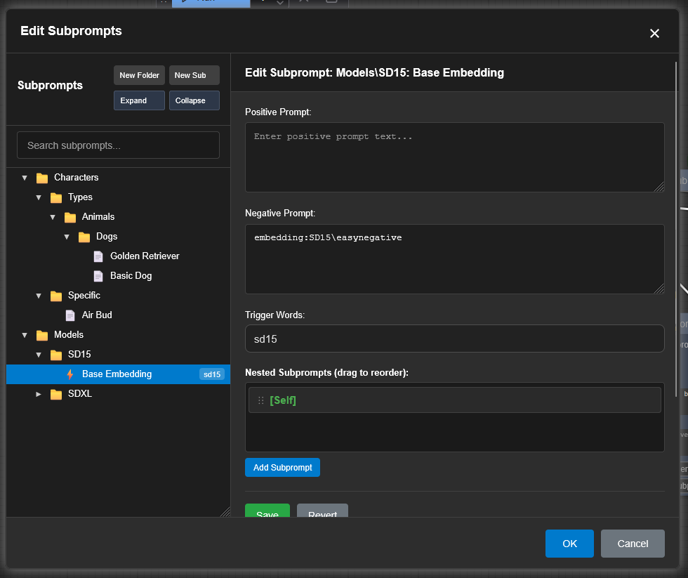
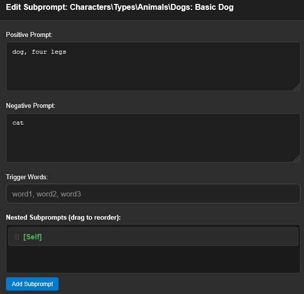
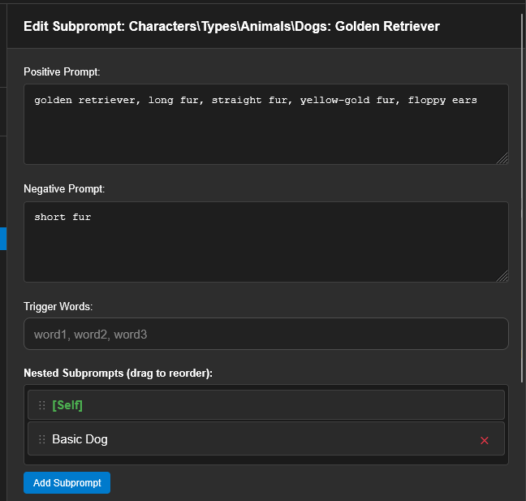
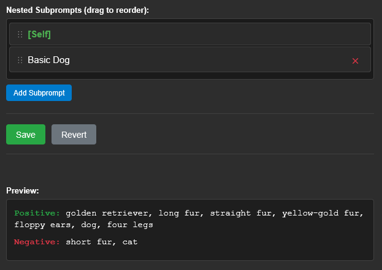

# ComfyUI Prompt Companion: Usage

The basic element of Prompt Companion is the "subprompt". Subprompts are grouped into folders for ease of organization. (Folders do not impact the operation of subprompts, they are purely cosmetic.)

Let's start with a view of one in the Edit Subprompts dialog, and then go through it.

## Quick Start

* To create a new folder/subprompt at the root level, use the buttons at the top.
* To create a new folder/subprompt in an existing folder, right-click the target folder.
* To rename/delete a folder/subprompt, or duplicate a subprompt, right-click it.
* You can click and drag subprompts and folders to move them.

## Concepts

A "subprompt" is made of several components:

* Positive and negative prompts. Self-explanatory.
    **Important!** These are the only two outputs that are passed between nodes. Everything else in this window is purely internal.
* Comma-separated "trigger words". These are used with the "Load Checkpoint with Subprompts" node to automatically load one or more subprompts based on the checkpoint name/path. All subprompts with a trigger word that appears in the checkpoint name/path will be merged together and exported as output from the node.
* A list of subprompts that will be pulled into this one and merged into its output. This is a very powerful tool for sharing styles, concepts, etc. across multiple subprompts. (Discussed more below.)

## Nested Subprompts

In the example above, you'll see several subfolders and subprompts in the Characters folder. These are all based around one of my favorite childhood movies, "Air Bud", about a dog that can play basketball.

First, we have the "dog" subprompt:

This subprompt is a very straightforward: dogs have four legs, and are not cats.

Next, we have the "Golden Retriever" subprompt:

The "Golden Retriever" subprompt has more details about what a Golden Retriever looks like: they have long yellow-gold fur, and floppy ears. They do _not_ have short for (otherwise they'd be a Labrador Retriever.)

But note that this subprompt _includes_ the subprompt "Basic Dog", which can be seen if you scroll all the way to the bottom of the dialog:

Whenever you include the "Golden Retriever" subprompt, it will automatically pull in the text of the "Basic Dog" subprompt and add it.

Multiple layers of nesting are supported, but you cannot create a circular chain of subprompts - e.g., if "Golden Retriever" contains "Basic Dog", then "Basic Dog" cannot contain "Golden Retriever", either directly or indirectly.

**NOTE:** In some cases, your nested subprompts may include duplicate terms - for example, you might have "dog" in both your "Golden Retriever" and "Basic Dog" prompts. In this case, Prompt Companion will remove all except the first one - e.g., `dog, golden retriever, dog, long fur` will become `dog, golden retriever, long fur`.